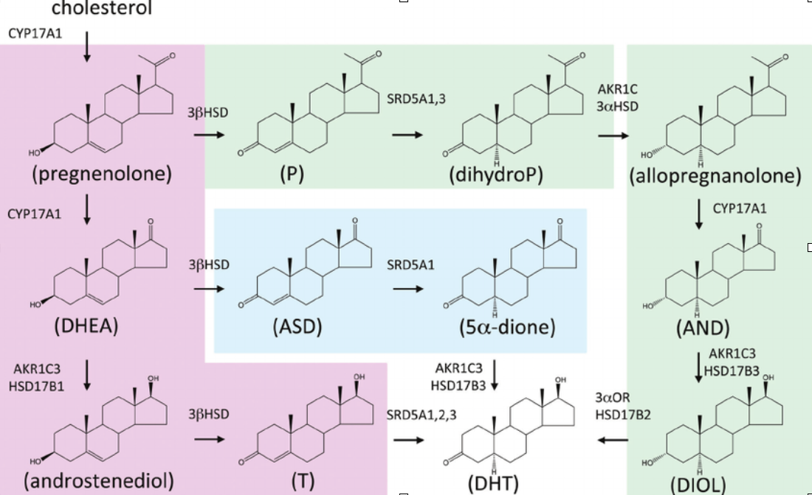
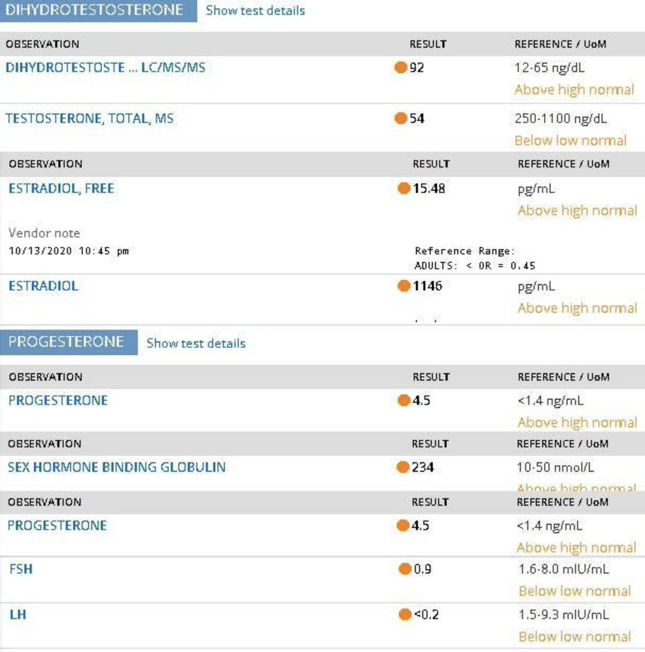

# 8 5α-还原酶抑制剂 双氢睾酮 (DHT) 篇

## 8.1 5α-还原酶抑制剂 —— 图片、价格、药商链接、仿制药名

> 非那雄胺 (Finasteride)；度他雄胺 (Dutasteride)
>
> Brand name: “Proscar”；”Avodart”

- 价格
  - 非那：~US$0.05 /mg
  - 度他：~US$0.35~0.7 /0.5mg
  - 【价格参考来自HRT.Cafe】

- 外国药商一列：
  - 非那：[HRT.Cafe (Finasteride)](https://hrt.cafe/finasteride/)
  - 度他：[HRT.Cafe (Dutasteride)](https://hrt.cafe/dutasteride/)

## 8.2 非那雄胺、度他雄胺（介绍、副作用、推荐剂量）

### 介绍

双氢睾酮(DHT)是一种比睾酮更强力的雄激素，其活性比睾酮高数倍。睾酮在人体某些组织内转化为DHT，而这转化是由5α-还原酶所引发的 ([Swerdloff et al., 2017](https://doi.org/10.1210/er.2016-1067))。存有5α-还原酶的组织非常有限，主要的有包括皮肤、毛囊和前列腺。尽管DHT比睾酮更强大，它作为循环激素的生物作用较低 ([Horton, 1992](https://doi.org/10.1002/j.1939-4640.1992.tb01621.x))，而睾酮则是主要的循环激素。

5α-还原酶抑制剂 (5α-RIs) 抑制5α-还原酶所导致的睾酮 → DHT转化，从而降低循环、组织中的DHT浓度。由于DHT主要是作为一个组织内的介质存在而不是循环激素，5α-RIs带来的抗雄作用有限。事实中证明5α-RIs在男性中不会引起明显的脱男性化现象 ([Hirshburg, 2016](https://www.ncbi.nlm.nih.gov/pmc/articles/PMC5023004/))。5α-RIs在医学上主要用于治疗雄性激素源性脱发、多毛症、前列腺增生。由于其特异性，5α-RIs不适合作为一般的抗雄激素药物来使用。此外，由于跨性别女性HRT中的雌激素使用所造成的睾酮抑制，DHT浓度一般上会随着睾酮浓度一同降低，所以5α-RIs的使用在大多数情况下是不必要的 ([Irwig, 2020](doi.org/10.1111/andr.12881))。但在特殊情况下，如果在跨性别女性中出现DHT造成的持续体毛生长或脱发（像在少数女性中发生的案例），5α-RIs可以作为有用的治疗药物使用 ([Barrionuevo et al., 2018](https://doi.org/10.1210/jc.2017-02052))。然而在这方面上，有更好的证据表示AR拮抗剂更加适合这治疗 ([van Zuuren et al., 2015](https://doi.org/10.1002/14651858.CD010334.pub2))，因为AR拮抗剂能同时拮抗睾酮与DHT而5α-RIs只能抑制5α-还原酶所转化的DHT。

### 非那雄胺、度他雄胺的区别

5α-还原酶有三种同功酶，分别为SRD5A1（Ⅰ型）、SRD5A2（Ⅱ型）、SRD5A3（Ⅲ型）。**度他雄胺能抑制全三个亚型**，而**非那雄胺只能抑制Ⅰ型与Ⅱ型**。由于这原因，度他雄胺是比非那雄胺更完全的5α-RIs。
**度他雄胺可有效降低98%的血清DHT水平**；*而非那雄胺只能降低65–70%*。
各种研究发现度他雄胺在治疗男性脱发中是比非那雄胺更有效的5α-RIs ([Zhou et al., 2018](https://doi.org/10.2147/CIA.S192435); [Dhurat et al., 2020](https://doi.org/10.1111/dth.13379))。

### 5α-RIs的副作用

- 一个有可能发生的副作用是5α-RIs的使用**可能会在没有任何睾酮抑制的情况下导致睾酮水平上升** ([Leinung et al., 2018](https://doi.org/10.1089/trgh.2017.0035); [Traish et al., 2019](https://doi.org/10.1016/j.sxmr.2018.06.002); Irwig, 2020)。似乎在睾酮水平较低且拥有睾丸的男性上，DHT增加了垂体上促性腺激素分泌的负反馈。这对于跨性别女性在HRT上的影响还不明。
- 另外一个潜在的不良作用是5α-RIs除了抑制5α-还原酶的DHT转化，也抑制了某些神经甾体。神经甾体是在神经组织中的甾体激素——主要是大脑。**5α-RIs抑制的神经甾体包括**：黄体酮的代谢产物——**四氢孕酮 (allopregnanolone)**，睾酮与DHT的代谢产物——**雄烷二醇 (3α-androstanediol)**。研究发现这些神经甾体有对情绪、焦虑、压力、和其他认知/情绪中有一定的生物调节作用 ([King, 2013](https://doi.org/10.1007/978-1-4614-5559-2_1))。同时这也**可能与少数抑郁等风险有关** ([Welk et al.,2018](https://doi.org/10.1001/jamainternmed.2017.0089); [Deng et al., 2020](https://doi.org/10.22037/uj.v16i7.5866); [Dyson, Cantrell, & Lund, 2020](https://doi.org/10.1097/JU.0000000000001079); [Nguyen et al., 2020](doi.org/10.1001/jamadermatol.2020.3385); [Wiki](https://en.wikipedia.org/wiki/5α-Reductase_inhibitor#Emotional_changes))

### 推荐剂量

- 度他雄胺 —— 口服：0.5mg/天
- 非那雄胺 —— 口服：0.25 ~ 5mg/天

## 8.3 关于DHT合成途径

以下会非常粗略的讲解以下DHT合成问题，以后如果有机会可能会对这DHT有关主题做个完整且深入的资料...

5α-还原酶抑制剂(5α-RIs)虽然有时候被称为DHT抑制剂，但事实上并不是。在大多数情况下，由于DHT是睾酮的代谢产物（睾酮 -> DHT 合成 ），而这个合成过程是5α-还原酶导致的，使用5α-RI确实是可以抑制此合成途径并降低DHT浓度。但是在非常罕见的情况下，DHT可以不通过此途径，而是从其他两个已知的合成途径产生。如果是从其他两个途径合成的DHT，非那雄胺或度他雄胺这种5α-RIs是对DHT抑制没效的。如果是肾上腺DHEA-S导致的
DHT合成，这应该是目前最难治疗的情况，目前据作者我所知只能使用 —— ([Abiraterone acetate](https://en.wikipedia.org/wiki/Abiraterone_acetate))。但这种DHT异常问题在跨性别女性中可能是非常罕见的，估计为少于4%。

DHT的3个来源途径为：

- 普通途径（5α-还原酶）
  - 睾酮 (T) → DHT
- 前门途径
  - DHEA-S → DHT
- 后门途径
  - 黄体酮 (P) → DHT

## 8.4 DHT异常 —— 例子

一般上被认为接受过“睾丸切除术或SRS”后的跨性别女性是完全不需要担心雄激素问题的，**但这个认识是不正确的**。*在可能性上是完全有可能在术后还是会因为雄激素的影响造成男性化症状的*。术后的女性一般上不用担心睾酮问题，但是在非常罕见的情况下，非常少数的人可能会拥有高水平DHT问题。

如果在术后，或是在使用高剂量雌激素、使用抗雄激素（如：CPA）来抑制睾酮的情况下DHT水平还是非常高，可以尝试使用比卡鲁胺和/或5α-RIs。CPA在这种异常DHT合成问题上是完全没用的；而螺内酯由于其AR拮抗作用太弱，是无法有效拮抗大量DHT的。
而且如果DHT的来源不是5α-还原酶合成，5α-RIs也是没用的。

**上图是来自一名接受过SRS（性别重置手术）后的跨性别女性。她由于感到身上的雄激素反应所以把雌二醇剂量调高，因此E2水平为1146 pg/mL。尽管这名女性的E2水平非常高，睾酮也是还属于女性值范围的情况下，DHT水平异常的高。这名术后跨性别女性拥有的DHT水平比一般持有睾丸的男性还更高。**

DHT标准水平：

- [Esoterix/LabCorp (2020)](https://drive.google.com/file/d/1AmUJqhstSmIrcEdqmx_hLINfQLkPqqDx/view?usp=sharing) — HPLC-MS/MS
  - 成年男性 —— 30–80 ng/dL
  - 成年女性 —— 4–22 ng/dL
- [Nakamoto (2016)](https://doi.org/10.1016/B978-0-323-18907-1.00154-2) — LC-MS/MS
  - 成年男性 —— 16–79 ng/dL
  - 成年女性 —— 5–46 ng/dL
